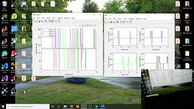

# Drone kanal sinyallerini MATLAB'da görselleştirmek

 potansiyometre_0.ino Arduino kodunu Arduino'ya yükleyin.  
Ardından MATLAB'ı açarak potansiyometre_drone.m dosyasını doğru port ismini girerek çalıştırın.  
MATLAB'ı açınca doğru portu bulmak için ***serialportlist*** komutunu kullanabilirsiniz (2019b'den sonraki MATLAB sürümlerinde). 
Eğer MATLAB sürümünüz 2019b'den önceki sürümler ise (2019a'dan başlayarak geri gidin) o zaman seriallist komutunu kulanın.
Alternatif olarak Windows'da Aygıt Yöneticisi'ne gidip orada Bağlantı Noktaları (COM ve LPT) üzerine tıklayabilirsiniz. 
Yukarıda Code yazan yeşil bağlantıya tıklarsanız bu sayfadaki kodları zip dosyası halinde bilgisayarınıza indirebilirsiniz. 
   

# Videoyu aşağıdaki resime tıklayarak izleyebilirsiniz 
  
